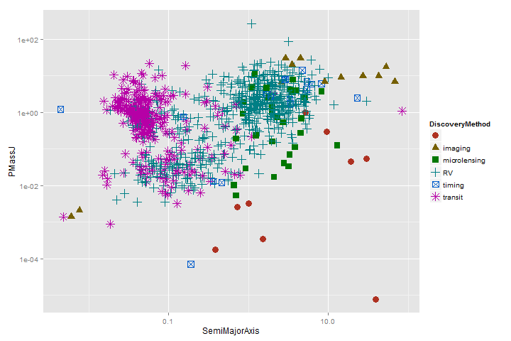
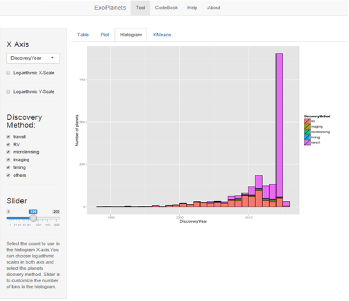

```{r scatter_plot, echo = FALSE, results='hide'}
source("image.R")
# this function makes the plot for img1.png (the other image, imgg0.png, is 
# a hand-made screenshot)
drawPlot() 
```

## What is ExoPlanet Tool?

An application that aims to provide a tool to help people exploring exoplanets data from different points of view and should be considered just as a first version model.

[1]:http://shiny.rstudio.com/
[2]:https://www.coursera.org/course/devdataprod
[3]:https://www.coursera.org/

Exoplanets data has been obtained from [Open Exoplanet Catalogue][4] - [github repo][5], an open source database of all discovered extrasolar planets:

*"The Open Exoplanet Catalogue is a catalogue of all discovered extra-solar planets. It is a new kind of astronomical database. It is decentralized and completely open. We welcome contributions and corrections from both professional astronomers and the general public."*

[4]: http://www.openexoplanetcatalogue.com/
[5]: https://github.com/OpenExoplanetCatalogue/oec_tables/

[Wikipedia on Exoplanets][6]:

"An **exoplanet** or **extrasolar planet** is a planet that does not orbit the Sun and instead orbits a different star, stellar remnant, or brown dwarf. More than 1800 exoplanets have been discovered (1890 planets in 1189 planetary systems including 477 multiple planetary systems as of 17 February 2015)."

[6]:http://en.wikipedia.org/wiki/Exoplanet

Try ExoPlanets Tool at https://miguel-conde.shinyapps.io/DDP-CP-Shiny/ !!!

--- .class 1 

## What you get



<p style="clear: both;"\>

--- .class 2  

## Menu Bar

Exoplanets Tool is organized around four options available in the menu bar you can find at the top of the webpage. These Options are:

- **Tool**: access to the ExoPlanets Tool
- **CodeBook**: displays the interpretation of the variables used in the data an tool.
- **Help**: acces to this HELP
- **About**: a brief explanation of the aims of this application, the origin of the used data and a note on exoplanets.

--- .class 3 

## Tool

This option, *Tool*, is selected by default when the application starts. Here you'll find four tabs:

- **Table**: shows an exoplanets data table that allows filtering and searches.
- **Plot**: shows an scatter plot whose X and Y variables can be fully selected.
- **Histogram**: shows an histogram whose X variable can be fully selected.
- **KMeans**: applies KMeans algorithm to X and y variables (you can select any of the available) and present results in a scatter plot.


Every and each of these four tabs is organized this way:

- Left sidebar panel: here you'll find tools for filtering and selecting data to work with and how.
- Main panel: results are presented in this area.

